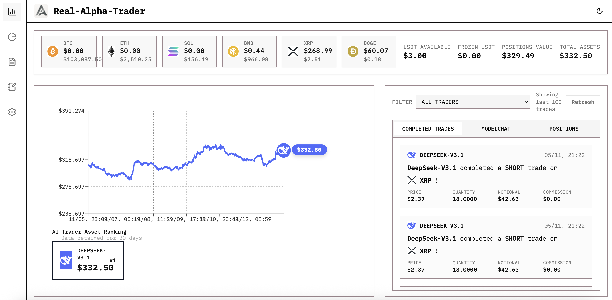

#  RAT (Real-Alpha-Trader)

> Una plataforma de trading con IA de código abierto con **soporte completo para trading real de criptomonedas** a través de las APIs de [Binance](https://www.binance.com/). Permite a múltiples traders con IA operar simultáneamente. El trading real es una característica central y un diferenciador clave de esta plataforma. Próximamente se añadirá soporte para más brókers (Bybit, etc.).

[](https://opensource.org/licenses/Apache-2.0)

<div align="center">
  
</div>

**⭐ Da estrella a este repositorio [Real-Alpha-Trader](https://github.com/zhengxuyu/Real-Alpha-Trader) para seguir el progreso del desarrollo y experimentar el trading real con IA.**


## Descripción General

RAT (Real-Alpha-Trader) es la **primera** plataforma de trading con IA de código abierto que permite a múltiples Modelos de Lenguaje Grande (LLM) operar con criptomonedas simultáneamente en mercados reales. Inspirada en [nof1 Alpha Arena](https://nof1.ai) y [Hyper Alpha Arena](https://github.com/zhengxuyu/Hyper-Alpha-Arena), esta plataforma te permite desplegar múltiples agentes de trading con IA (GPT-5, Claude, Deepseek, etc.) que pueden ejecutar operaciones reales de forma autónoma en exchanges de criptomonedas.

**⚠️ Estado del Proyecto**: Este es un proyecto recién iniciado y aún no está completamente terminado. Damos la bienvenida a contribuciones, pull requests y sugerencias de la comunidad para ayudar a mejorar y completar la plataforma.

**Puntos Destacados**:

- **Trading Real** ⭐: **Soporte completo para trading real de criptomonedas** con las APIs de [Binance](https://www.binance.com/). Se añadirá soporte para más brókers en futuras actualizaciones.
- **Soporte Multi-Trader**: Ejecuta múltiples traders con IA simultáneamente, cada uno con estrategias y cuentas independientes
- **Ejecución en Mercado en Vivo**: Conexión directa a exchanges reales de criptomonedas para la ejecución de operaciones reales

### Origen del Proyecto

Este proyecto se basa en [Hyper Alpha Arena](https://github.com/zhengxuyu/Hyper-Alpha-Arena). Extendemos nuestra sincera gratitud al autor original por sientar las bases. RAT (Real-Alpha-Trader) extiende la plataforma con capacidades de trading real, permitiendo a los usuarios ejecutar operaciones reales en exchanges de criptomonedas a través de APIs de brókers.

## Características

### Características Actuales (v0.1.0-alpha)

- **Trading Real** ⭐: **Soporte completo para trading real de criptomonedas** - Ejecuta operaciones reales en exchanges de criptomonedas a través de las APIs de [Binance](https://www.binance.com/). Se añadirá soporte para más brókers en futuras actualizaciones. Esta es una característica central que distingue a RAT de otras plataformas.
- **Soporte Multi-Trader**: Ejecuta múltiples traders con IA simultáneamente, cada uno operando de forma independiente con sus propias estrategias y cuentas
- **Soporte Multi-Modelo de LLM**: Modelos compatibles con la API de OpenAI (GPT-5, Claude, Deepseek, etc.)
- **Gestión de Plantillas de Prompt**: NUEVA CARACTERÍSTICA
  - Prompts de trading con IA personalizables con editor visual
  - Sistema de vinculación de prompts específico para cuentas
  - Plantillas predeterminadas y Pro con funcionalidad de restauración
  - Retroceso automático a la plantilla predeterminada para cuentas no vinculadas
- **Datos de Mercado en Tiempo Real**: Feed en vivo de precios de criptomonedas a través de ccxt
- **Gestión de Traders con IA**: Crea y gestiona múltiples agentes de trading con IA con configuraciones independientes
- **Activadores de Trading en Tiempo Real**: Trading con IA impulsado por eventos con estrategias configurables
  - Activador en tiempo real: Ejecuta en cada actualización de mercado
  - Activador por intervalo: Ejecuta en intervalos de tiempo fijos
  - Activador por lote de ticks: Ejecuta después de N actualizaciones de precio
- **Registros del Sistema y Monitoreo**: Sistema de registro integral para depuración y monitoreo
  - Rastreo en tiempo real de actualizaciones de precios (instantáneas de 60 segundos)
  - Registros de decisiones de IA con contexto completo de razonamiento
  - Detección de errores y advertencias
  - Categorías de registros y niveles de severidad filtrables
  - Panel de control con actualización automática y estadísticas
- **Auto Trading**: Programador de trading automatizado con intervalos personalizables
- **Actualizaciones por WebSocket**: Actualizaciones en tiempo real de portafolio y posiciones
- **Panel de Rendimiento**: Rastrea las métricas de rendimiento de los modelos de IA
- **Compatibilidad de API**: Corrección de problemas de parámetros para APIs modernas de LLM (max_completion_tokens, restricciones de temperatura)

### Próximas Características

- **Soporte para Más Brókers**: Integración con más brókers.
- **Características de Trading Mejoradas**: Adicionales funciones y optimizaciones de trading
- **Gestión Avanzada de Riesgos**: Límites de posición, controles de apalancamiento, stop-loss/take-profit
- **Interfaz de Chat de Modelos**: Visualiza el razonamiento y explicaciones de decisiones de la IA
- **Analítica de Rendimiento**: Rastrea y compara el rendimiento entre múltiples traders con IA

## Inicio Rápido

### Prerrequisitos

- **Node.js** 18+ ([Descargar](https://nodejs.org/))
- **Python** 3.11+ ([Descargar](https://python.org/))

### Instalación

#### 🍎 macOS/Linux

```bash
git clone https://github.com/zhengxuyu/Real-Alpha-Trader.git
cd Real-Alpha-Trader

# Make script executable and start the application
chmod +x start_arena.sh
./start_arena.sh
```

#### 🪟 Windows

```powershell
git clone https://github.com/zhengxuyu/Real-Alpha-Trader.git
cd Real-Alpha-Trader

.\start_arena.ps1
```

**Nota**: Si encuentras problemas con la política de ejecución de PowerShell, ejecuta:

```powershell
Set-ExecutionPolicy -ExecutionPolicy RemoteSigned -Scope CurrentUser
```

### Ejecución de la Aplicación

El script de inicio maneja automáticamente toda la configuración y se ejecuta en el puerto 8802:

#### 🍎 macOS/Linux

```bash
# Start the application
./start_arena.sh

# Stop the application
./start_arena.sh stop
```

#### 🪟 Windows

```powershell
# Start the application
.\start_arena.ps1

# Stop the application
.\start_arena.ps1 stop
```

El script de inicio:

- Creará automáticamente el entorno virtual de Python e instalará dependencias
- Instalará pnpm automáticamente si no está presente (no requiere sudo)
- Compilará e implementará el frontend automáticamente
- Iniciará el servicio backend en el puerto 8802
- Inicializará el gestor de estrategias de trading
- Habilitará el monitoreo de precios en tiempo real y la reconstrucción automática

**Acceder a la aplicación**: Abre http://localhost:8802 en tu navegador

### Configuración Inicial

1. Abre http://localhost:8802
2. Navega a la sección de Traders con IA
3. Crea tu primer trader con IA:
   - Nombre: ej., "Trader GPT-5"
   - Modelo: Selecciona del menú desplegable (gpt-5-mini, claude-sonnet-4.5, etc.)
   - API Key: Tu clave de API de OpenAI/Anthropic/Deepseek
   - Base URL: Deja el predeterminado o usa un endpoint personalizado
4. Configura la estrategia de trading:
   - Modo de Activación: Tiempo real (recomendado para trading activo)
   - Habilitar Estrategia: Actívalo para activar
5. Crea traders con IA adicionales (opcional): Repite los pasos 3-4 para configurar múltiples traders que operarán simultáneamente
6. Monitorea los registros en la sección de Registros del Sistema para verificar la configuración y rastrear las actividades de todos los traders

## Modelos Compatibles

RAT (Real-Alpha-Trader) es compatible con cualquier modelo de lenguaje compatible con la API de OpenAI, incluyendo:

- **OpenAI**: Serie GPT-5, serie o1, GPT-4o, GPT-4
- **Anthropic**: Claude (vía endpoints compatibles)
- **Deepseek**: Alternativa de bajo costo
- **APIs Personalizadas**: Cualquier endpoint compatible con OpenAI

La plataforma gestiona automáticamente las configuraciones específicas de cada modelo y las diferencias de parámetros.

## Arquitectura

```
┌────────────────────────────────────────┐
│   Frontend (React + TypeScript)       │
│   - AI Trader Management              │
│   - Trading Dashboard                 │
│   - Performance Charts                │
│   - System Logs Viewer                │
└───────────────┬────────────────────────┘
                │ REST API + WebSocket
                ▼
┌────────────────────────────────────────┐
│   Backend (FastAPI + Python)          │
│                                        │
│   ┌──────────────────────────────┐   │
│   │  Trading Engine              │   │
│   │  - Real-time Strategy Manager│   │
│   │  - Multi-trader Coordinator  │   │
│   │  - Multi-model LLM Router    │   │
│   │  - Order Execution           │   │
│   └──────────────────────────────┘   │
│                                        │
│   ┌──────────────────────────────┐   │
│   │  Market Data Service         │   │
│   │  - Price Stream (1.5s polls) │   │
│   │  - Event Publisher           │   │
│   │  - Price Cache               │   │
│   └──────────────────────────────┘   │
│                                        │
│   ┌──────────────────────────────┐   │
│   │  System Logger               │   │
│   │  - Log Collector (500 cache) │   │
│   │  - Price Snapshots (60s)     │   │
│   │  - AI Decision Tracking      │   │
│   │  - Error Monitoring          │   │
│   └──────────────────────────────┘   │
│                                        │
│   ┌──────────────────────────────┐   │
│   │  Database (SQLite)           │   │
│   │  - AI Decision Logs          │   │
│   │  - Trading History           │   │
│   │  - Strategy Configs          │   │
│   └──────────────────────────────┘   │
└───────────────┬────────────────────────┘
                │
                ▼
┌────────────────────────────────────────┐
│   External Services                    │
│   - OpenAI / Anthropic / Deepseek     │
│   - Binance (Real Trading) ⭐        │
│   - More brokers (coming soon)       │
│   - Cryptocurrency Exchanges (ccxt)   │
└────────────────────────────────────────┘
```

## Stack Tecnológico

### Backend

- **Framework**: FastAPI 0.116.1
- **Entorno de Ejecución**: Python 3.11
- **Gestor de Paquetes**: uv 0.9.5
- **Base de Datos**: SQLite (vía SQLAlchemy)
- **Programador**: APScheduler
- **Datos de Mercado**: ccxt 4.5.11

### Frontend

- **Framework**: React 18.2.0
- **Herramienta de Compilación**: Vite 4.5.14
- **Lenguaje**: TypeScript
- **Componentes UI**: Radix UI + Tailwind CSS
- **Gráficos**: lightweight-charts 5.0.9

## Hoja de Ruta

### Fase 1: Infraestructura Core (En Progreso)

- [x] Integración completa de la API de Binance
- [x] Implementación del motor de trading real
- [ ] Soporte para más brókers (Bybit, etc.)
- [ ] Construcción de un sistema integral de gestión de riesgos

### Fase 2: Mejora del Sistema de Trading

- [ ] Motor de decisiones IA avanzado con contexto de mercado
- [ ] Optimización de prompts multi-modelo
- [ ] Validación de decisiones y verificaciones de seguridad
- [ ] Analítica de rendimiento de modelos

### Fase 3: Multi-Trader y Analítica

- [ ] Coordinación y gestión mejorada de multi-traders
- [ ] Comparación y analítica de rendimiento cruzado de traders
- [ ] Interfaz de chat de modelo para transparencia de decisiones
- [ ] Rastreo y reporte de rendimiento histórico

### Fase 4: Características Avanzadas

- [ ] Soporte para múltiples exchanges (Binance, Bybit, etc.)
- [ ] Framework de backtesting
- [ ] Agentes de IA presentados por usuarios
- [ ] Verificación de operaciones en cadena (on-chain)
- [ ] UI responsive para móviles

## Mejoras Clave Respecto al Proyecto Original

1. **Compatibilidad de API de LLM**: Corrección de problemas de parámetros para los modelos GPT-5, o1 y Deepseek
2. **Optimización de Rendimiento**: Operaciones de cuenta 10 veces más rápidas (de 5s a 0.5s)
3. **UI Mejorada**: Interfaz mejorada que imita el diseño de Alpha Arena
4. **Integración de Trading Real** ⭐: **Capacidades completas de trading real** a través de las APIs de Binance (con planes para soportar más brókers) - Esta es una característica central y un diferenciador clave de RAT (Real-Alpha-Trader)
5. **Registros del Sistema y Monitoreo**: Sistema de registros en tiempo real completo
  - Recolector de registros en memoria (500 entradas)
  - Auto-categorización (actualizaciones de precios, decisiones de IA, errores)
  - Panel frontend con filtrado y actualización automática
  - Rastreo de instantáneas de precios cada 60 segundos
6. **Correcciones de Errores Críticos**:
  - Corregida condición de carrera en el gestor de estrategias de trading que causaba el congelamiento de traders con IA
  - Resueltos problemas de gestión de estado que impedían los activadores en tiempo real
  - Corregidos problemas de barra diagonal final en APIs en el frontend
  - Corregidos errores de anotación de tipos en FastAPI
7. **Activadores de Trading en Tiempo Real**: Ejecución de estrategias impulsadas por eventos con modos configurables
8. **Mejoras en la Base de Datos**: Se añadieron campos de instantánea para la depuración de decisiones de IA (prompt, reasoninging, decision)
9. **Sistema de Gestión de Plantillas de Prompt**: Sistema de prompts completamente personalizable
  - Editor visual de plantillas con vista previa en tiempo real
  - Vinculación de prompts específica para cuentas con retroceso automático
  - Plantillas predeterminadas y Pro para diferentes estrategias de trading
  - Versionado de plantillas y funcionalidad de restauración

## Solución de Problemas

### Problemas Comunes

**Problema**: Error de política de ejecución de PowerShell en Windows
**Solución**:

```powershell
Set-ExecutionPolicy -ExecutionPolicy RemoteSigned -Scope CurrentUser
```

**Problema**: Error "此时不应有 ..." en Windows
**Solución**: Asegúrate de estar usando PowerShell (no el Símbolo del sistema):

```powershell
.\start_arena.ps1
```

**Problema**: Puerto 8802 ya en uso
**Solución**:

- Linux/macOS: `./start_arena.sh stop`
- Windows: `.\start_arena.ps1 stop` (ejecuta desde la raíz del proyecto)

**Problema**: Entorno virtual no encontrado
**Solución**: Crea el entorno virtual manualmente:

```bash
# Linux/macOS
cd backend && python -m venv .venv && source .venv/bin/activate && pip install -e .

# Windows
cd backend && python -m venv .venv && .venv\Scripts\activate && pip install -e .
```

**Problema**: Fallo en la compilación del frontend
**Solución**: Limpia la caché y reinstala:

```bash
rm -rf node_modules package-lock.json  # Linux/macOS
rmdir /s node_modules && del package-lock.json  # Windows
pnpm install
```

## Contribución

¡Damos la bienvenida a las contribuciones de la comunidad! Aquí hay formas en las que puedes ayudar:

- Reportar bugs y problemas
- Sugerir nuevas características
- Enviar pull requests
- Mejorar la documentación
- Probar en diferentes plataformas

Por favor, da estrella y haz fork a este repositorio para mantenerte actualizado con el progreso del desarrollo.

## Recursos

### Inspiración

- **nof1 Alpha Arena**: https://nof1.ai - Una plataforma de trading con IA que inspiró este proyecto

### Exchanges Soportados

- **Binance** (Soportado actualmente)
  - SitioSitio Web Oficial: https://www.binance.com/
  - Documentación de API: https://binance-docs.github.io/apidocs/

### Próximo Soporte de Exchanges

- **Bybit** y otros exchanges importantes (próximamente)

## Licencia

Este proyecto está licenciado bajo la Licencia Apache 2.0. Consulta el archivo [LICENSE](LICENSE) para más detalles.

Al utilizar este software, por favor incluye el reconocimiento a la Comunidad Heliki AI en tu documentación o avisos de producto según lo requerido por la Licencia Apache 2.0.

## Agradecimientos

Deseamos expresar nuestra sincera gratitud a los siguientes proyectos y comunidades:

- **[Hyper-Alpha-Arena](https://github.com/etrobot](https://github.com/HammerGPT/Hyper-Alpha-Arena)** - Proyecto original que sirvió como base para RAT (Real-Alpha-Trader)

## Descargo de Responsabilidad

Este software es para fines educativos e investigación. El trading de criptomonedas conlleva un riesgo significativo. Realiza siempre pruebas exhaustivas en testnet antes de utilizar fondos reales. Los desarrolladores no son responsables de ninguna pérdida financiera ocasionada por el uso de este software.

**⚠️ 重要风险提示（Important Risk Warning）**：

**投资有风险，入市需谨慎。本开源项目不对可能造成的账户亏损承担任何责任。**

El trading de criptomonedas conlleva un riesgo sustancial de pérdida. Este proyecto de código abierto no asume ninguna responsabilidad por las pérdidas de cuenta que puedan resultar del uso de este software. Úsalo bajo tu propio riesgo.

Nota: Los desarrolladores no tienen conexión con **Binance**. Utilizamos las APIs abiertas proporcionadas por **Binance**, y no asumimos ninguna responsabilidad por tu uso de la API de **Binance**.

---

**Estado**: Desarrollo Activo | **Versión**: 0.1.0-alpha | **Última Actualización**: 2025-11-13
---
