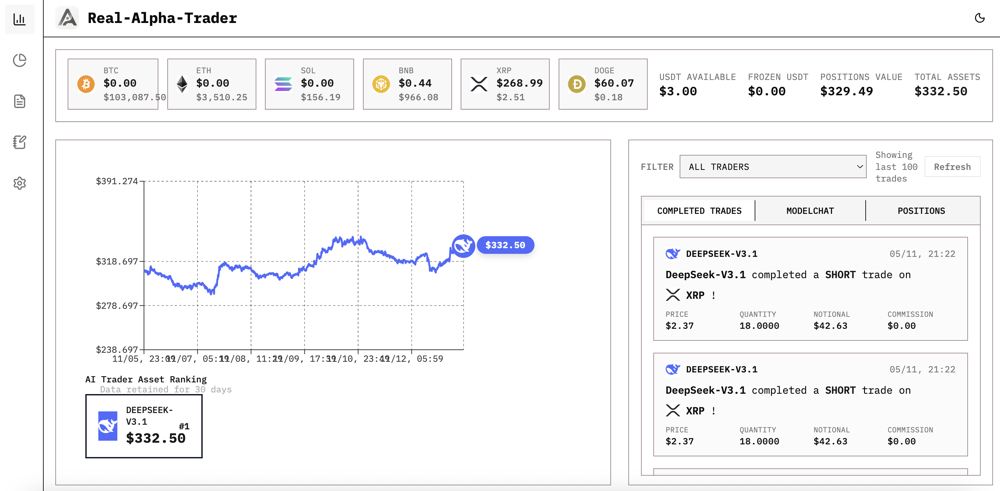

#  RAT (Real-Alpha-Trader)

> An open-source AI trading platform with **full real cryptocurrency trading support** via [Binance](https://www.binance.com/) APIs. Support multiple AI traders trading simultaneously. Real trading is a core feature and key differentiator of this platform. Additional broker support (Bybit, etc.) coming soon.

[](https://opensource.org/licenses/Apache-2.0)

<div align="center">
  
</div>

**⭐ Star this repo [Real-Alpha-Trader](https://github.com/zhengxuyu/Real-Alpha-Trader) to follow development progress and experience real AI trading.**


## Overview

RAT (Real-Alpha-Trader) is the **first** open-source AI trading platform that enables multiple Large Language Models (LLMs) to trade cryptocurrencies simultaneously in real markets. Inspired by [nof1 Alpha Arena](https://nof1.ai) and [Hyper Alpha Arena](https://github.com/zhengxuyu/Hyper-Alpha-Arena), this platform allows you to deploy multiple AI trading agents (GPT-5, Claude, Deepseek, etc.) that can autonomously execute real trades on cryptocurrency exchanges.

**⚠️ Project Status**: This is a newly started project and is not yet fully complete. We welcome contributions, pull requests, and suggestions from the community to help improve and complete the platform.

**Key Highlights**:

- **Real Trading** ⭐: **Full support for real cryptocurrency trading** with [Binance](https://www.binance.com/) APIs. Support for additional brokers will be added in future updates.
- **Multi-Trader Support**: Run multiple AI traders simultaneously, each with independent strategies and accounts
- **Live Market Execution**: Direct connection to real cryptocurrency exchanges for actual trade execution

### Project Origin

This project is based on [Hyper Alpha Arena](https://github.com/zhengxuyu/Hyper-Alpha-Arena). We extend our sincere gratitude to the original author for laying the groundwork. RAT (Real-Alpha-Trader) extends the platform with real trading capabilities, enabling users to execute actual trades on cryptocurrency exchanges through broker APIs.

## Features

### Current Features (v0.1.0-alpha)

- **Real Trading** ⭐: **Full support for real cryptocurrency trading** - Execute actual trades on cryptocurrency exchanges via [Binance](https://www.binance.com/) APIs. Support for additional brokers will be added in future updates. This is a core feature that sets RAT apart from other platforms.
- **Multi-Trader Support**: Run multiple AI traders simultaneously, each operating independently with their own strategies and accounts
- **Multi-Model LLM Support**: OpenAI API compatible models (GPT-5, Claude, Deepseek, etc.)
- **Prompt Template Management**: NEW FEATURE
  - Customizable AI trading prompts with visual editor
  - Account-specific prompt binding system
  - Default and Pro templates with restore functionality
  - Automatic fallback to default template for unbound accounts
- **Real-time Market Data**: Live cryptocurrency price feeds via ccxt
- **AI Trader Management**: Create and manage multiple AI trading agents with independent configurations
- **Real-time Trading Triggers**: Event-driven AI trading with configurable strategies
  - Real-time trigger: Execute on every market update
  - Interval trigger: Execute at fixed time intervals
  - Tick batch trigger: Execute after N price updates
- **System Logs & Monitoring**: Comprehensive logging system for debugging and monitoring
  - Real-time price update tracking (60-second snapshots)
  - AI decision logs with full reasoning context
  - Error and warning detection
  - Filterable log categories and severity levels
  - Auto-refresh dashboard with statistics
- **Auto Trading**: Automated trading scheduler with customizable intervals
- **WebSocket Updates**: Real-time portfolio and position updates
- **Performance Dashboard**: Track AI model performance metrics
- **API Compatibility**: Fixed parameter issues for modern LLM APIs (max_completion_tokens, temperature restrictions)

### Upcoming Features

- **Additional Broker Support**: Integration with more brokers.
- **Enhanced Trading Features**: Additional trading features and optimizations
- **Advanced Risk Management**: Position limits, leverage controls, stop-loss/take-profit
- **Model Chat Interface**: View AI reasoning and decision explanations
- **Performance Analytics**: Track and compare performance across multiple AI traders

## Quick Start

### Prerequisites

- **Node.js** 18+ ([Download](https://nodejs.org/))
- **Python** 3.11+ ([Download](https://python.org/))

### Installation

#### 🍎 macOS/Linux

```bash
git clone https://github.com/zhengxuyu/Real-Alpha-Trader.git
cd Real-Alpha-Trader

# Make script executable and start the application
chmod +x start_arena.sh
./start_arena.sh
```

#### 🪟 Windows

```powershell
git clone https://github.com/zhengxuyu/Real-Alpha-Trader.git
cd Real-Alpha-Trader

.\start_arena.ps1
```

**Note**: If you encounter PowerShell execution policy issues, run:

```powershell
Set-ExecutionPolicy -ExecutionPolicy RemoteSigned -Scope CurrentUser
```

### Running the Application

The startup script automatically handles all setup and runs on port 8802:

#### 🍎 macOS/Linux

```bash
# Start the application
./start_arena.sh

# Stop the application
./start_arena.sh stop
```

#### 🪟 Windows

```powershell
# Start the application
.\start_arena.ps1

# Stop the application
.\start_arena.ps1 stop
```

The startup script will:

- Auto-create Python virtual environment and install dependencies
- Auto-install pnpm if not present (no sudo required)
- Build and deploy frontend automatically
- Start the backend service on port 8802
- Initialize the trading strategy manager
- Enable real-time price monitoring and auto-rebuild

**Access the application**: Open http://localhost:8802 in your browser

### First-Time Setup

1. Open http://localhost:8802
2. Navigate to AI Traders section
3. Create your first AI trader:
   - Name: e.g., "GPT-5 Trader"
   - Model: Select from dropdown (gpt-5-mini, claude-sonnet-4.5, etc.)
   - API Key: Your OpenAI/Anthropic/Deepseek API key
   - Base URL: Leave default or use custom endpoint
4. Configure trading strategy:
   - Trigger Mode: Real-time (recommended for active trading)
   - Enable Strategy: Toggle to activate
5. Create additional AI traders (optional): Repeat steps 3-4 to set up multiple traders that will trade simultaneously
6. Monitor logs in System Logs section to verify setup and track all traders' activities

## Supported Models

RAT (Real-Alpha-Trader) supports any OpenAI API compatible language model, including:

- **OpenAI**: GPT-5 series, o1 series, GPT-4o, GPT-4
- **Anthropic**: Claude (via compatible endpoints)
- **Deepseek**: Cost-effective alternative
- **Custom APIs**: Any OpenAI-compatible endpoint

The platform automatically handles model-specific configurations and parameter differences.

## Architecture

```
┌────────────────────────────────────────┐
│   Frontend (React + TypeScript)       │
│   - AI Trader Management              │
│   - Trading Dashboard                 │
│   - Performance Charts                │
│   - System Logs Viewer                │
└───────────────┬────────────────────────┘
                │ REST API + WebSocket
                ▼
┌────────────────────────────────────────┐
│   Backend (FastAPI + Python)          │
│                                        │
│   ┌──────────────────────────────┐   │
│   │  Trading Engine              │   │
│   │  - Real-time Strategy Manager│   │
│   │  - Multi-trader Coordinator  │   │
│   │  - Multi-model LLM Router    │   │
│   │  - Order Execution           │   │
│   └──────────────────────────────┘   │
│                                        │
│   ┌──────────────────────────────┐   │
│   │  Market Data Service         │   │
│   │  - Price Stream (1.5s polls) │   │
│   │  - Event Publisher           │   │
│   │  - Price Cache               │   │
│   └──────────────────────────────┘   │
│                                        │
│   ┌──────────────────────────────┐   │
│   │  System Logger               │   │
│   │  - Log Collector (500 cache) │   │
│   │  - Price Snapshots (60s)     │   │
│   │  - AI Decision Tracking      │   │
│   │  - Error Monitoring          │   │
│   └──────────────────────────────┘   │
│                                        │
│   ┌──────────────────────────────┐   │
│   │  Database (SQLite)           │   │
│   │  - AI Decision Logs          │   │
│   │  - Trading History           │   │
│   │  - Strategy Configs          │   │
│   └──────────────────────────────┘   │
└───────────────┬────────────────────────┘
                │
                ▼
┌────────────────────────────────────────┐
│   External Services                    │
│   - OpenAI / Anthropic / Deepseek     │
│   - Binance (Real Trading) ⭐        │
│   - More brokers (coming soon)       │
│   - Cryptocurrency Exchanges (ccxt)   │
└────────────────────────────────────────┘
```

## Tech Stack

### Backend

- **Framework**: FastAPI 0.116.1
- **Runtime**: Python 3.11
- **Package Manager**: uv 0.9.5
- **Database**: SQLite (via SQLAlchemy)
- **Scheduler**: APScheduler
- **Market Data**: ccxt 4.5.11

### Frontend

- **Framework**: React 18.2.0
- **Build Tool**: Vite 4.5.14
- **Language**: TypeScript
- **UI Components**: Radix UI + Tailwind CSS
- **Charts**: lightweight-charts 5.0.9

## Roadmap

### Phase 1: Core Infrastructure (In Progress)

- [x] Complete Binance API integration
- [x] Implement real trading engine
- [ ] Support for additional brokers (Bybit, etc.)
- [ ] Build comprehensive risk management system

### Phase 2: Trading System Enhancement

- [ ] Advanced AI decision engine with market context
- [ ] Multi-model prompt optimization
- [ ] Decision validation and safety checks
- [ ] Model performance analytics

### Phase 3: Multi-Trader & Analytics

- [ ] Enhanced multi-trader coordination and management
- [ ] Cross-trader performance comparison and analytics
- [ ] Model chat interface for decision transparency
- [ ] Historical performance tracking and reporting

### Phase 4: Advanced Features

- [ ] Multiple exchange support (Binance, Bybit, etc.)
- [ ] Backtesting framework
- [ ] User-submitted AI agents
- [ ] On-chain trade verification
- [ ] Mobile-responsive UI

## Key Improvements Over Original Project

1. **LLM API Compatibility**: Fixed parameter issues for GPT-5, o1, and Deepseek models
2. **Performance Optimization**: 10x faster account operations (5s to 0.5s)
3. **Enhanced UI**: Improved interface mimicking Alpha Arena design
4. **Real Trading Integration** ⭐: **Full real trading capabilities** via Binance APIs (with plans to support additional brokers) - This is a core feature and key differentiator of RAT (Real-Alpha-Trader)
5. **System Logging & Monitoring**: Comprehensive real-time logging system
   - In-memory log collector (500 entries)
   - Auto-categorization (price updates, AI decisions, errors)
   - Frontend dashboard with filtering and auto-refresh
   - Price snapshot tracking every 60 seconds
6. **Critical Bug Fixes**:
   - Fixed race condition in trading strategy manager causing AI traders to freeze
   - Resolved state management issues preventing real-time triggers
   - Corrected API trailing slash issues in frontend
   - Fixed FastAPI type annotation errors
7. **Real-time Trading Triggers**: Event-driven strategy execution with configurable modes
8. **Database Enhancements**: Added snapshot fields for AI decision debugging (prompt, reasoning, decision)
9. **Prompt Template Management System**: Complete customizable prompt system
   - Visual template editor with real-time preview
   - Account-specific prompt binding with automatic fallback
   - Default and Pro templates for different trading strategies
   - Template versioning and restore functionality

## Troubleshooting

### Common Issues

**Problem**: Windows PowerShell execution policy error
**Solution**:

```powershell
Set-ExecutionPolicy -ExecutionPolicy RemoteSigned -Scope CurrentUser
```

**Problem**: "此时不应有 ..." error on Windows
**Solution**: Ensure you're using PowerShell (not Command Prompt):

```powershell
.\start_arena.ps1
```

**Problem**: Port 8802 already in use
**Solution**:

- Linux/macOS: `./start_arena.sh stop`
- Windows: `.\start_arena.ps1 stop` (run from project root)

**Problem**: Virtual environment not found
**Solution**: Create the virtual environment manually:

```bash
# Linux/macOS
cd backend && python -m venv .venv && source .venv/bin/activate && pip install -e .

# Windows
cd backend && python -m venv .venv && .venv\Scripts\activate && pip install -e .
```

**Problem**: Frontend build fails
**Solution**: Clear cache and reinstall:

```bash
rm -rf node_modules package-lock.json  # Linux/macOS
rmdir /s node_modules && del package-lock.json  # Windows
pnpm install
```

## Contributing

We welcome contributions from the community! Here are ways you can help:

- Report bugs and issues
- Suggest new features
- Submit pull requests
- Improve documentation
- Test on different platforms

Please star and fork this repository to stay updated with development progress.

## Resources

### Inspiration

- **nof1 Alpha Arena**: https://nof1.ai - An AI trading platform that inspired this project

### Supported Exchanges

- **Binance** (Currently Supported)
  - Official Website: https://www.binance.com/
  - API Docs: https://binance-docs.github.io/apidocs/

### Upcoming Exchange Support

- **Bybit** and other major exchanges (coming soon)

## License

This project is licensed under the Apache License 2.0. See the [LICENSE](LICENSE) file for details.

When using this software, please include attribution to Heliki AI Community in your documentation or product notices as required by the Apache License 2.0.

## Acknowledgments

We would like to express our sincere gratitude to the following projects and communities:

- **[Hyper-Alpha-Arena](https://github.com/etrobot](https://github.com/HammerGPT/Hyper-Alpha-Arena)** - Original project that served as the foundation for RAT (Real-Alpha-Trader)

## Disclaimer

This software is for educational and research purposes. Cryptocurrency trading carries significant risk. Always conduct thorough testing on testnet before using real funds. The developers are not responsible for any financial losses incurred through the use of this software.

**⚠️ 重要风险提示（Important Risk Warning）**：

**投资有风险，入市需谨慎。本开源项目不对可能造成的账户亏损承担任何责任。**

Trading cryptocurrencies involves substantial risk of loss. This open-source project does not assume any responsibility for account losses that may result from using this software. Use at your own risk.

Note: The developers have no connection with **Binance**. We use the open APIs provided by **Binance**, and we do not take any responsibility for your use of the **Binance** API.

---

**Status**: Active Development | **Version**: 0.1.0-alpha | **Last Updated**: 2025-11-13
---
